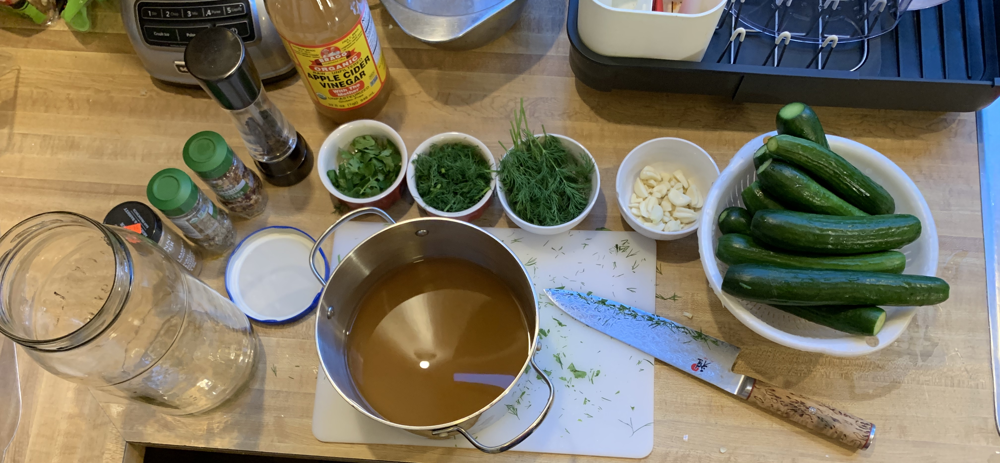
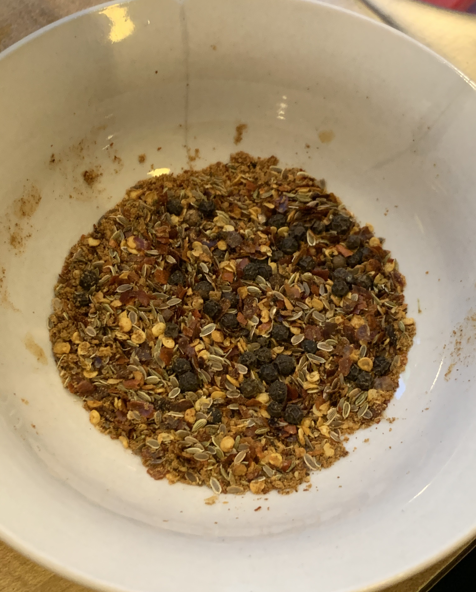
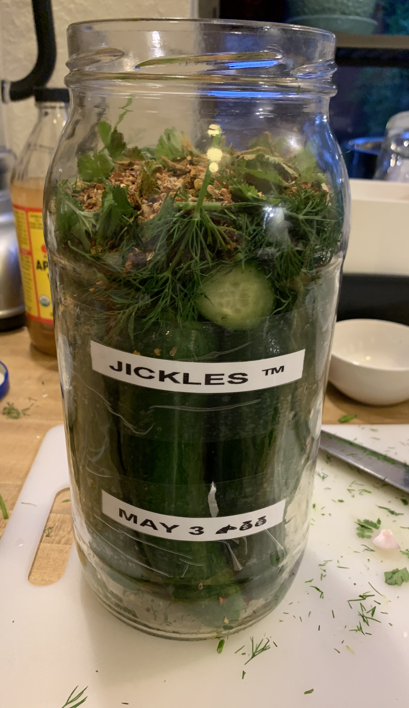
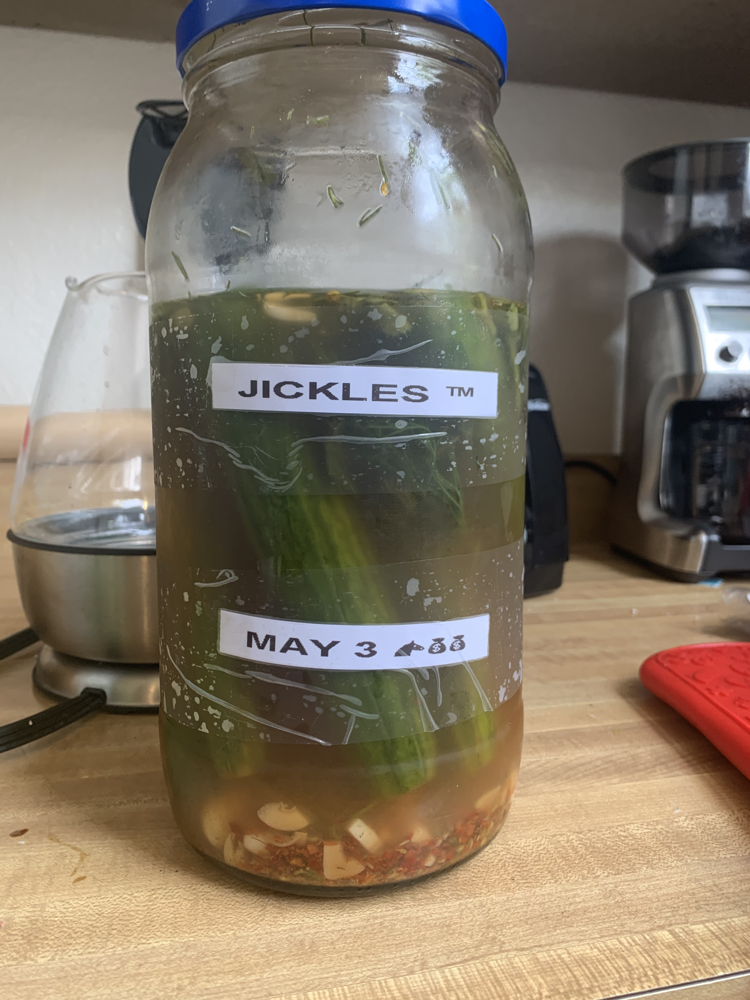

# Jickle Recipe

The super official recipe of the totally trademarked Jickle.

_Version: 1_

## Ingredients

- [ ] jar to hold jickles
- [ ] ~10 Cucumbers
  - Use medium size cucumbers
- [ ] ~3 cups apple cider vinegar
- [ ] ~3 cups water
- [ ] 2 tablespoons sea salt
- [ ] 1.5 cup dill
- [ ] 1/2 cup cilantro
- [ ] ~15 garlic cloves
  - To taste, about 1.5 per cucumber
- [ ] 1.5 teaspoon dill seed
- [ ] 1 teaspoon whole black peppercorn
- [ ] 1 teaspoon large grind black peppercorn
- [ ] 1 teaspoon crushed red pepper
- [ ] 1 teaspoon cayenne pepper

## Assembly

**1.** Boil all water in kettle.

**2.** Add 1.5 cup boiled water, 1.5 cup vinegar, and salt to sauce pan. Bring to boil, stirring occasionally.

**3.** Wash cucumbers. Remove a small slice from each end. Shake off excess water in strainer, leave aside.

**4.** Remove large stems from dill. Pick out smallest 1.5 cups of dill leaf, leave aside. Chop 1.5 cups of dill, leave aside.

**5.** Chop cilantro, leave aside.

**6.** Smash half of garlic, leave aside. Slice half of garlic in halves, leave aside.

**7.** Combine dill seed, whole black peppercorn, large grind black peppercorn, crushed red pepper, and cayenne pepper in a bowl, leave aside.

**8.** Add pickles to jar. Spread dill, cilantro, and spices over top.

**9.** Add warm mixture of water, vinegar, and salt from sauce pan to jickle jar. Fill remaining space with 1/2 cup of (not boiled) vinegar, and 1/2 cup of (previously boiled) water.

**10.** Let jar cool to around room temperature. Add to refrigerator. Note these jickles are not shelf stable and require refrigeration.

**11.** Wait ~4 days for optimal jickling.

## TODOs

- [ ] Verify measurement on
  - [ ] Garlic
  - [ ] Dill
  - [ ] Cilantro
- [ ] Hands smell like feet after eating, not ideal

## Notes

- Recipes to use for inspiration
  - [Garlic Dill Pickles Recipe - Marisa McClellan](https://www.seriouseats.com/recipes/2011/08/garlic-dill-pickles.html)
